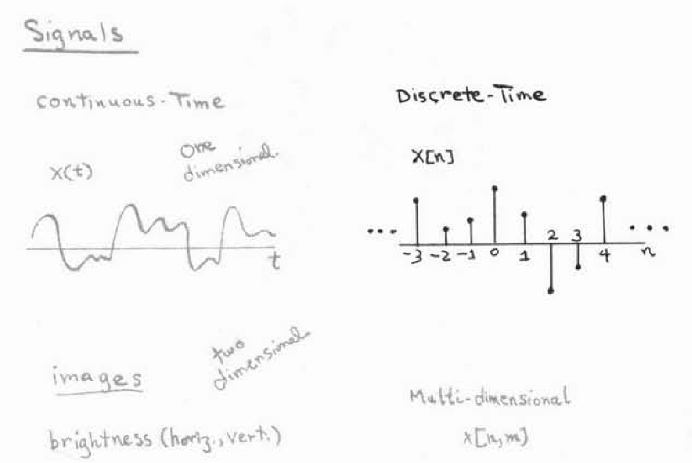

# Signals and systems: an Introduction to Analog and Digital Signal Processing
## Lecture 1: Introduction

- Signals
  - continuous time
    - speech signal 
      - $\mathrm{x}(t)$  one dimensional
    - images
      - $\mathrm{brightness(horiz, vert)}$ two dimensional
    - for convenience, we tend to refer to the independent variables when we talk about signals as time variables. Whether or not they really do represent time.
  - discrete time
    -  stock market index
      - $\mathrm{x[n]}$ one dimensional
    - spatial and time ray
      - $\mathrm{x[n,m]}$ multi-dimensional

- Systems
  - classification
    - linear or not
      - linear
      - Nonlinear
    - time-varying or not
      - time-invariant
      - time-varying
  - This course will focus on **LTI - linear time-invariant systems**
  - Interconnections of systems
    - series
    - parallel
    - feedback
  - Domains for analysis and representation
    - Time domain - How to change?
      - $\mathrm{x[n]}$ 
      - $\mathrm{x(t)}$
    - Frequency domain - How to represent?
      - Fourier transform
      - Laplace transform (Extensions of the Fourier transform)
      - z-transform (a discrete time counterpart of Laplace transform)

